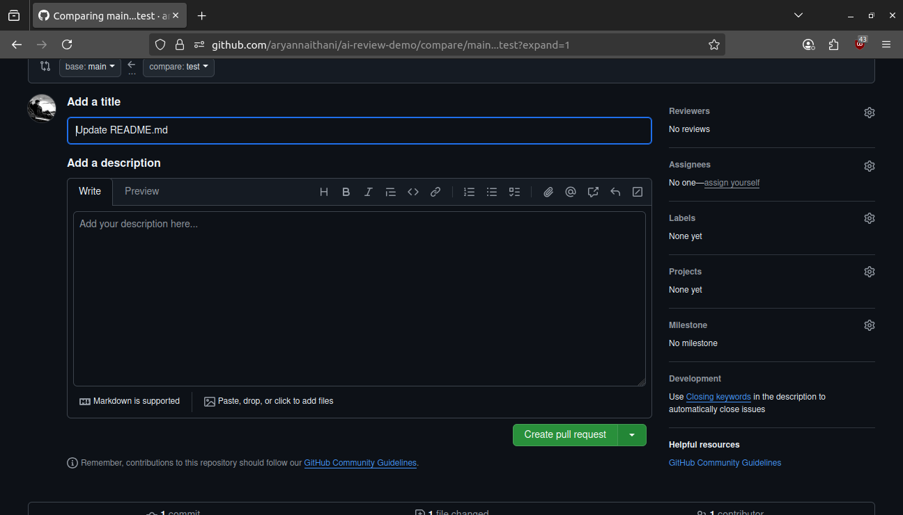
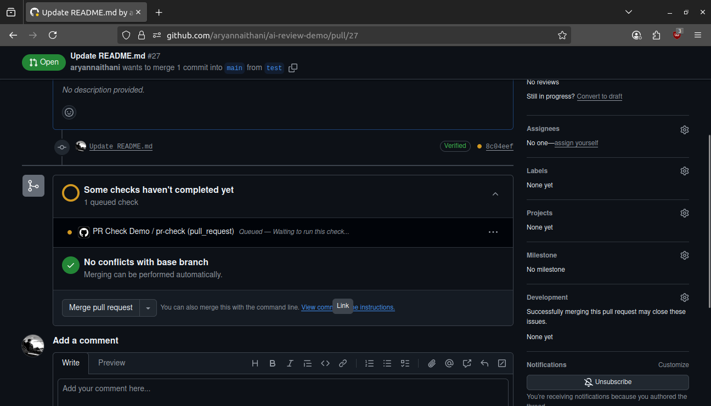
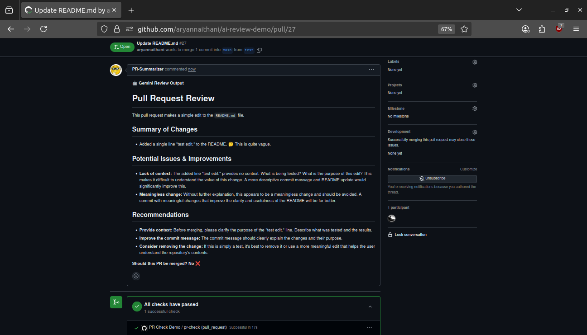

# Code Review Action

This GitHub Action automatically analyzes pull requests using AI to provide meaningful reviews, suggestions and also gives us a clear signal if the PR is ready to be merged or not.  
This helps developers maintain high code quality, consistency, and prevents tedious cycles of going through poorly documented new code so they can focus on innovating.

## Features
- Automated AI-powered code review on pull requests.
- Analyzes differences and then provide insights and suggestions for improvements.
- Easy to integrate into any repository.

## Example
- **Some user forms a different branch and changes things and submits a pull request.**
 
  
  
- **On opening the pull request the action automatically starts doing its thing.**
  
  
  
- **After a few seconds an in depth and beautifully formatted review is posted in the pull request comments.**
  
  

## Setup Guide

1. Copy the `.github/workflows/action.yml` workflow file into your repository of choice under `.github/workflows/`.
2. Copy the `scripts/main.py` python script into your repository of choice under `scripts/`.
3. Create a GitHub secret for your Gemini API key which you can find <a href="https://aistudio.google.com/app/apikey" target="_blank">here</a>:
   - Go to your repository **Settings > Secrets and variables > Actions**.
   - Add a new secret with the name: `GEMINI_API_KEY`.
   - Add your Gemini key in the provided section.
4. Now whenever you open a pull request in this repository, the action will run and post a review in the comments of that pull request.
5. Thanks for visiting.

## Contributing
Feel free to open issues or pull requests(which i will review using this action :)) to improve this project.
